# Web Application Security Lab — SafeLine WAF & DVWA


---

## Table of Contents

- [Why I Built This](#why-i-built-this)
- [Lab Environment](#lab-environment)
  - [Architecture Overview](#architecture-overview)
- [The Target — DVWA](#the-target--dvwa)
- [Attack & Defense](#attack--defense--what-actually-happened)
  - [SQL Injection](#sql-injection-sqli)
  - [Cross-Site Scripting](#cross-site-scripting-xss)
  - [HTTP Flood Attack](#http-flood-attack)
  - [IP Blocking](#ip-blocking)
  - [Authentication Protection](#authentication-protection)
  - [HTTPS Enforcement](#https-enforcement)
- [Attack vs. Protection Summary](#attack-vs-protection-summary)
- [WAF Monitoring & Logs](#waf-monitoring--logs)
- [What I Took Away](#what-i-took-away)
- [Challenges & What Went Wrong](#challenges--what-went-wrong)
- [Limitations](#limitations)
- [Future Work](#future-work)
- [Technologies Used](#technologies-used)
- [Setup Reference](#setup-reference)
- [Author](#author)

---

## Why I Built This

Most of what you learn in cybersecurity courses stays theoretical for way too long. I wanted to actually *see* what a Web Application Firewall does — not just know that it "blocks malicious traffic." So I built a small isolated lab where I could attack a real vulnerable app, watch the WAF respond, and understand exactly what's happening at each layer.

The setup is simple: one machine attacks, one machine defends. Everything runs locally in VirtualBox. No cloud, no complex infra — just enough to make the concepts real.

---

## Lab Environment

Two VirtualBox VMs connected over a bridged network, both visible on the same subnet as the host.

| Role | Machine | IP Address |
|------|---------|------------|
| Attacker | Kali Linux | `10.118.26.19` |
| Server / Defender | Ubuntu Server 22.04 | `10.118.26.157` |

The Ubuntu server runs three components:
- **DVWA** — the vulnerable target app, served by Apache on internal port `8080`
- **MySQL** — backend database for DVWA
- **SafeLine WAF** — reverse proxy sitting in front of everything on port `443`

The domain `webapp.test` resolves to the Ubuntu IP via `/etc/hosts` on both machines. Kali never communicates with DVWA directly — all traffic is routed through the WAF first.

### Architecture Overview

#### Lab Setup Overview

Two VMs on a bridged network. Ubuntu hosts DVWA (Apache on port 8080), MySQL, and SafeLine WAF (reverse proxy on port 443). Kali connects only through the WAF — never directly to DVWA.

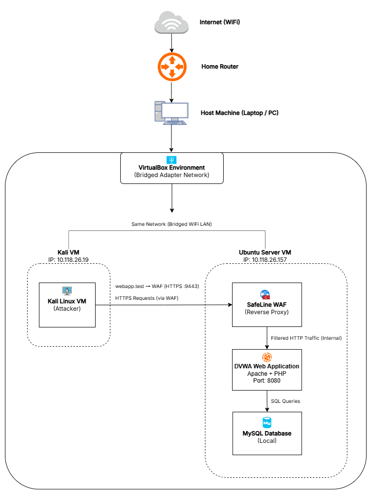

#### Attack Flow Architecture

Every attack originates from Kali and hits SafeLine first. Depending on whether the WAF is active, the request is either dropped at the WAF layer or forwarded through to DVWA.

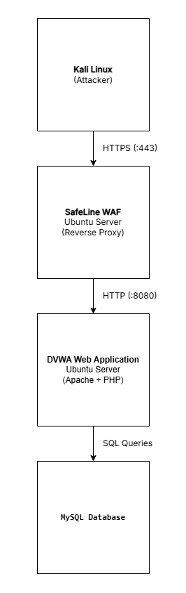

---

## The Target — DVWA

DVWA (Damn Vulnerable Web Application) is a deliberately insecure PHP/MySQL app designed for security testing. It has configurable security levels — I set it to **Low** so the vulnerabilities are completely open and unmitigated, making it an ideal baseline to demonstrate what the WAF intercepts.

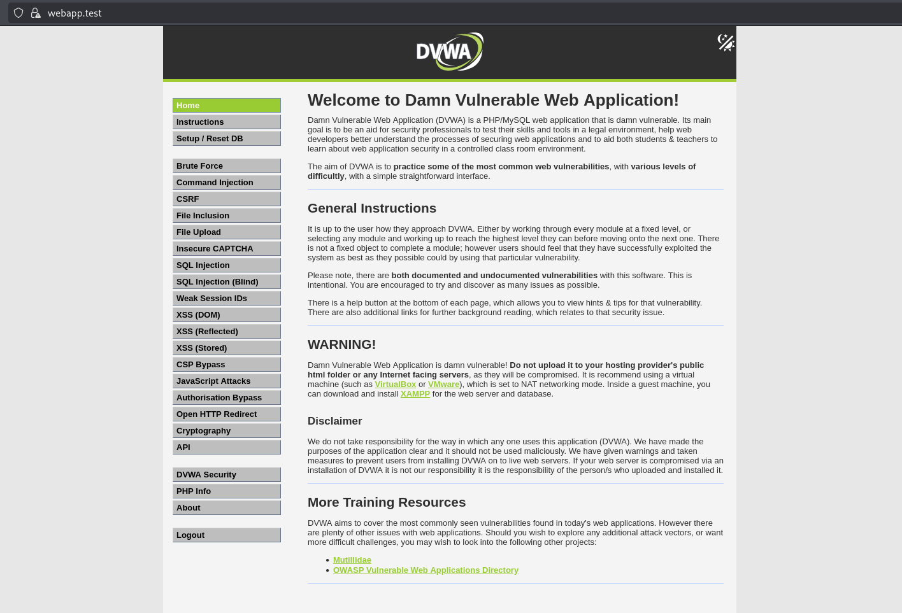

---

## Attack & Defense — What Actually Happened

### SQL Injection (SQLi)

SQL Injection is one of the most common and damaging web vulnerabilities. It works by inserting SQL syntax into input fields that get passed directly into database queries — allowing an attacker to read, modify, or delete data they're not supposed to touch.

I tested DVWA's SQL Injection page using a classic bypass payload:

```sql
' OR '1'='1
```

#### Without WAF
The query executes. The database returns all user records — full read access with no credentials required.

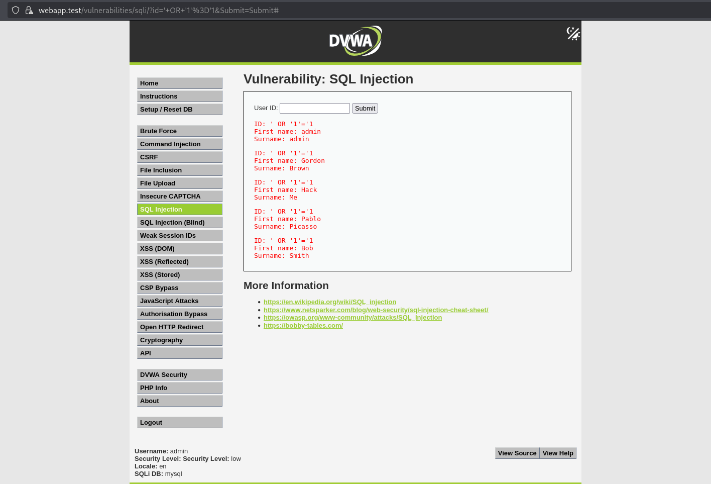

#### With SafeLine WAF
SafeLine detects the injection pattern in the request payload and drops it before it ever reaches Apache or MySQL. DVWA receives nothing.

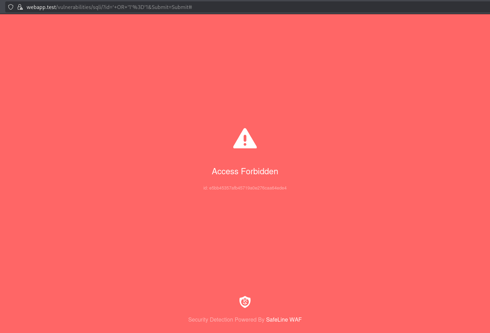

---

### Cross-Site Scripting (XSS)

XSS lets an attacker inject client-side scripts into pages that other users view. In the reflected XSS case, the malicious input is immediately echoed back in the response — so if the app doesn't sanitize it, the script runs in the victim's browser.

Payload submitted through DVWA's reflected XSS input:

```html
<script>alert(1)</script>
```

#### Without WAF
The alert fires. The browser executes the injected script. In a real attack this could steal session cookies, redirect users, or log keystrokes.

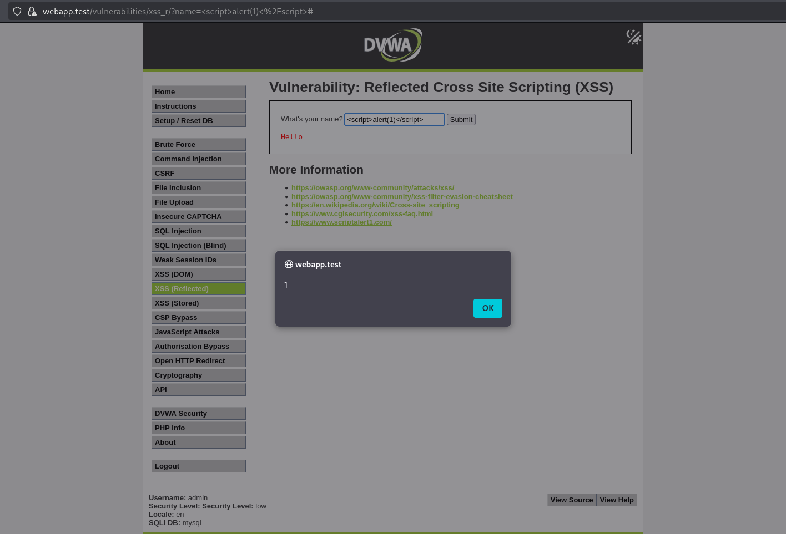

#### With SafeLine WAF
SafeLine identifies and strips the script tag from the request. The app receives clean input — nothing executes.

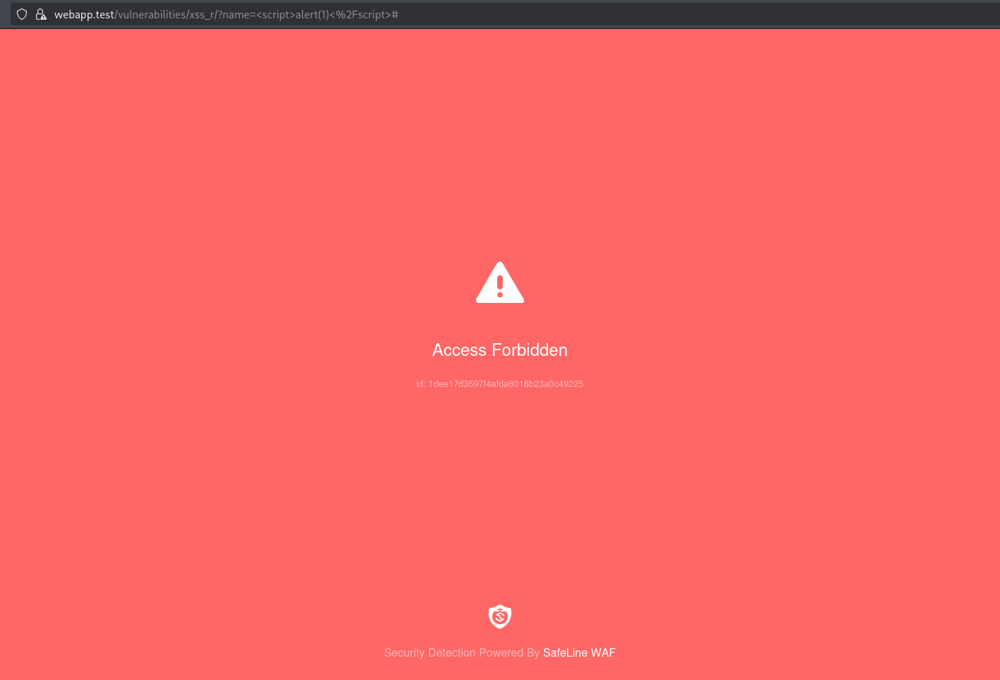

---

### HTTP Flood Attack

An HTTP Flood is a Layer 7 denial-of-service attack — instead of exploiting a vulnerability in the app, it just drowns the server in requests until it can't serve legitimate users anymore. No malformed packets, no special payloads, just volume.

I simulated this from Kali by firing a high volume of concurrent requests at the WAF endpoint.

#### Without WAF
The server becomes overwhelmed. Response times degrade and the app becomes unavailable to legitimate users.

#### With SafeLine WAF
Rate-limiting kicked in once the request rate crossed the configured threshold. The attacker's IP started getting dropped while the app remained accessible to normal traffic.


---

### IP Blocking

Beyond payload-based detection, SafeLine also supports manual deny rules.

#### Without IP Block Rule
Any IP — including known attackers — can reach the app freely. There is no network-level access control in place.

#### With IP Block Rule Active
Kali's IP (`10.118.26.19`) was added to a custom block list. Every request from that machine was dropped at the WAF regardless of content — useful for quickly containing a known attacker during an incident.

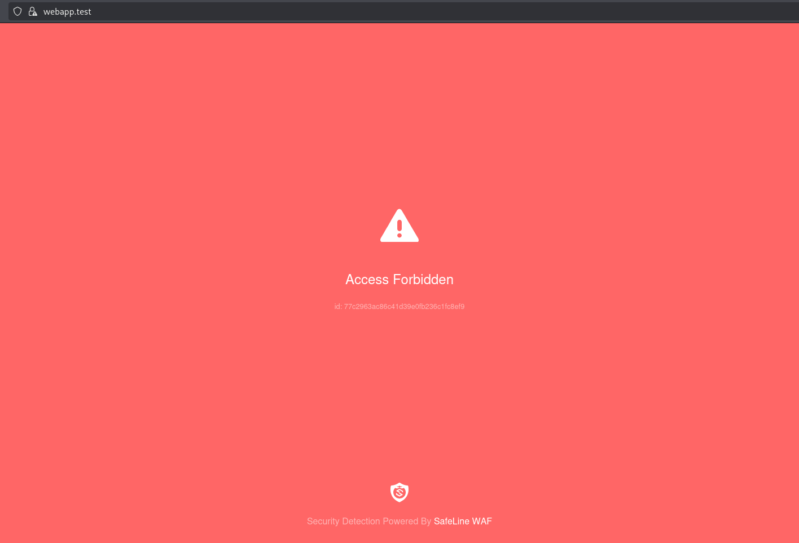

---

### Authentication Protection

SafeLine has a built-in auth gateway that can sit in front of any proxied application.

#### Without Auth Gateway
Anyone who knows the domain or backend address can reach DVWA directly — no login required.

#### With WAF Auth Gateway Enabled
Users must authenticate with the WAF before it forwards any traffic to the backend. The app itself never sees unauthenticated requests.

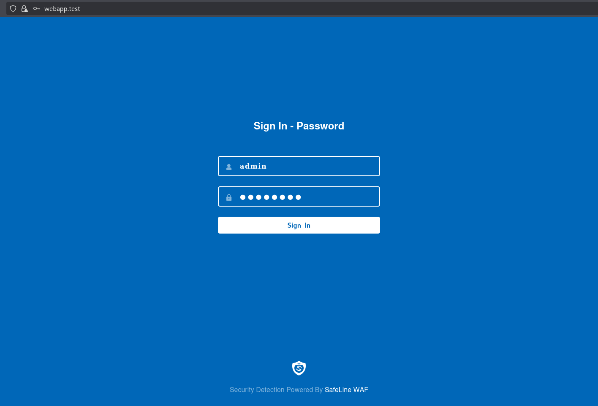

---

### HTTPS Enforcement

The WAF listens only on port `443`. Port `80` is intentionally removed from the listener config — there's no HTTP fallback. The self-signed SSL certificate was generated with OpenSSL and imported into SafeLine's certificate manager.

All external communication is encrypted. Internally, the WAF talks to DVWA over plain HTTP on port `8080` — a standard termination pattern where encryption happens at the edge, not end-to-end between internal services.

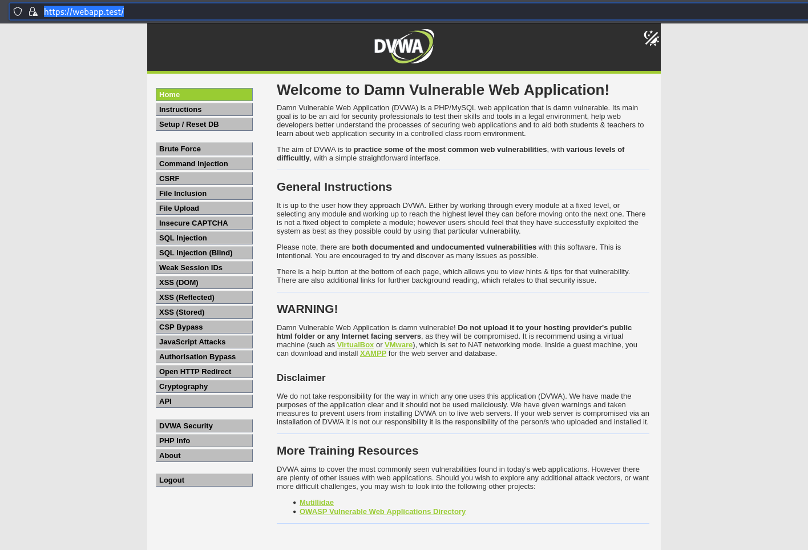

---

## Attack vs. Protection Summary

| Attack / Mechanism | Without WAF | With SafeLine WAF |
|--------------------|-------------|-------------------|
| SQL Injection | Database records exposed | Payload detected, request dropped |
| Cross-Site Scripting | Script executes in browser | Script stripped before reaching app |
| HTTP Flood | Server overwhelmed, unavailable | Rate-limited, availability maintained |
| Unauthorized IP Access | Allowed through | Blocked at WAF layer |
| Unauthenticated Access | Direct app access | WAF auth challenge enforced |
| Plain HTTP (port 80) | Accessible | Not exposed — HTTPS only |

---

## WAF Monitoring & Logs

One of the most useful parts of running SafeLine was the visibility it provides. The dashboard gives a live view of request volume, blocked threats, and active rules. Every blocked request is logged with source IP, timestamp, attack classification, and the action taken.

This is what makes a WAF operationally useful — not just the blocking, but knowing *what* was blocked, *when*, and *where it came from*.

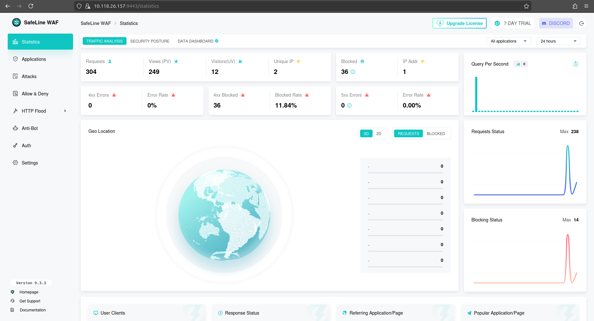

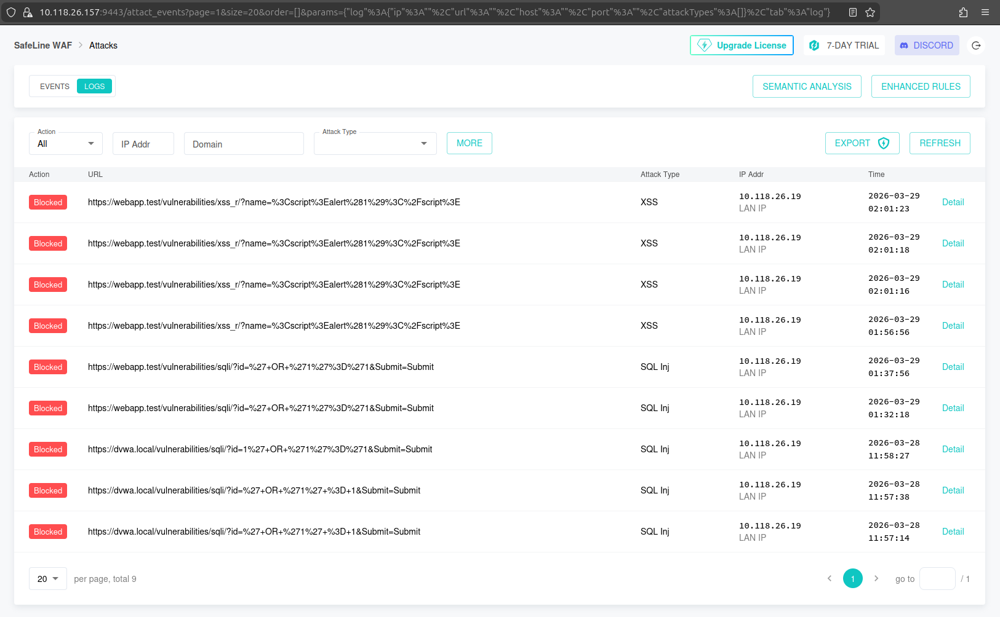

---

## What I Took Away

- **The reverse proxy model is everything.** The backend being completely unreachable from outside — unless traffic passes through the WAF — is what makes this architecture meaningful. It's not just filtering, it's network isolation.
- **Attacks are simpler than they sound.** A SQL injection that exposes an entire database is one line. XSS that runs arbitrary JavaScript in someone's browser is one tag. Seeing it work without protection makes the threat feel real in a way no diagram does.
- **Rate limiting and IP blocking are fast, blunt tools.** They're not elegant, but in an active incident they're the first things you reach for.
- **Logs are the actual value.** A WAF blocking silently isn't enough. The logging is what lets you understand attack patterns, tune rules, and prove that your defenses are working.
- **Internal HTTP, external HTTPS is a real pattern.** Not a shortcut or a flaw in this lab — it's exactly how most production reverse proxy setups work.

---

## Challenges & What Went Wrong

- **LAMP stack setup** — minor PHP extension gaps on the first install, resolved quickly by installing the missing packages. DVWA came up without issues after that.
- **DVWA database** — `config.inc.php` needed to be created from the sample file and credentials aligned, but once done `/setup.php` completed without any issues.
- **Apache port conflict** — after moving to port 8080, the default site config still referenced port 80 and had to be updated separately before the WAF forwarded traffic correctly.

---

## Limitations

- Self-signed SSL certificate (not production-grade)
- Single-server setup (no load balancing)
- Limited rule customization compared to enterprise WAFs
- Internal traffic is not encrypted (HTTP between WAF and backend)

---

## Future Work

- Deploy on cloud infrastructure (AWS / Azure) with load balancing
- Implement advanced WAF rule tuning and SIEM integration for centralized logging
- Add a network-level firewall (e.g. pfSense) alongside the application-layer WAF
- Explore AI-based automated threat detection to identify novel attack patterns

---

## Technologies Used

| Tool | Purpose |
|------|---------|
| VirtualBox | Hypervisor — runs both VMs locally |
| Kali Linux | Attacker machine — penetration testing toolkit |
| Ubuntu Server 22.04 LTS | Server — hosts WAF, app, and database |
| SafeLine WAF | Reverse proxy WAF — traffic inspection, filtering, logging |
| DVWA | Intentionally vulnerable target web application |
| Apache2 | Web server for DVWA |
| PHP | Application runtime for DVWA |
| MySQL | Backend database |
| OpenSSL | Self-signed SSL certificate generation |

---

## Setup Reference

The setup follows standard documentation. Below are the key configuration decisions specific to this lab.

| Component | Config |
|---|---|
| VirtualBox VMs | Bridged Adapter — both on the same subnet |
| Apache | Runs on port 8080; WAF handles external traffic on port 443 |
| Local DNS | `webapp.test` mapped to Ubuntu IP via `/etc/hosts` on both machines |
| SSL | Self-signed certificate generated with OpenSSL (1 year) |
| SafeLine WAF | Installed via official script; management UI available on port 9443 |
| WAF upstream | `http://10.118.26.157:8080` → proxied through `webapp.test:443` |

---

> **Disclaimer:** This lab is built and run entirely in an isolated local network environment. All attack simulations are conducted against systems I own and control. Never use these techniques against systems without explicit authorization.

---

## Author

Om Kashyap — [github.com/theomkashyap](https://github.com/theomkashyap)

---

Licensed under the [MIT License](LICENSE).
